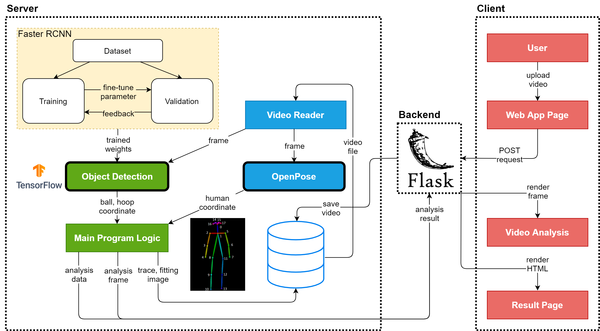
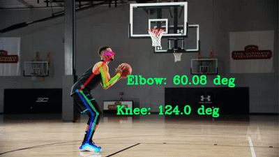

# AI Basketball Analysis

<p align="center">
    
</p>

<p align="center">
    <a target="_blank" href="https://travis-ci.com/chonyy/AI-basketball-analysis" title="Build Status"></a>
    <a target="_blank" href="#" title="language count"></a>
    <a target="_blank" href="#" title="top language"></a>
    <a target="_blank" href="https://img.shields.io/github/pipenv/locked/python-version/chonyy/daily-nba" title="Python version"></a>
    <a target="_blank" href="https://opensource.org/licenses/MIT" title="License: MIT"></a>
    <a target="_blank" href="#" title="repo size"></a>
    <a target="_blank" href="http://makeapullrequest.com" title="PRs Welcome"></a>
</p>

> 🏀 **Analyze basketball shots and shooting pose with machine learning!**

_This is an AI-powered application focused on **object detection** to analyze basketball shots. The app allows users to upload basketball videos for analysis or submit **POST requests** to an API. Results include detailed shot and pose analysis based on object detection data. The project utilizes **OpenPose** to compute body keypoints and other metrics._

---

## 📖 _Project Overview_

_AI Basketball Analysis leverages artificial intelligence to break down basketball shots by detecting player movements, shot accuracy, and pose data. It uses the popular [OpenPose](https://github.com/CMU-Perceptual-Computing-Lab/openpose) framework for human pose estimation. Whether you're a developer or sports analyst, this project helps explore how AI can automate and enhance basketball analysis._

> **Important**: _This project is for **noncommercial research use only**, as it uses OpenPose's license. Please review the [LICENSE](https://github.com/chonyy/AI-basketball-analysis/blob/master/LICENSE) for details._

_If you're new to human pose estimation, check out this [summary article](https://towardsdatascience.com/openpose-research-paper-summary-realtime-multi-person-2d-pose-estimation-3563a4d7e66) that breaks down OpenPose's key concepts._

---

## 🚀 _Getting Started_

### 1. **Clone the Repository**
_To get a copy of the project, run the following command:_
```bash
git clone https://github.com/chonyy/AI-basketball-analysis.git
```

### 2. **Install Dependencies**
_Before running the project, ensure all necessary dependencies are installed by running:_
```bash
pip install -r requirements.txt
```

> **Note**: _This project requires a **GPU with CUDA support** to run OpenPose efficiently, especially for video analysis._

### 3. **Run the Application**
_Once everything is set up, you can host the project locally with a simple command:_
```bash
python app.py
```

_This will launch the application locally, where you can upload basketball videos or images for analysis._

### _Hosting Options_
_If you'd prefer not to run the project locally, you can try these alternatives:_

#### **Google Colab** _(No GPU required!)_
_Thanks to [hardik0](https://github.com/hardik0/AI-basketball-analysis-on-google-colab), you can experiment with the AI Basketball Analysis in **Google Colab** without needing your own GPU:_
[](https://colab.research.google.com/github/hardik0/AI-basketball-analysis-on-google-colab/blob/master/AI_basketball_analysis_google_colab.ipynb)

#### **Heroku Hosting**
_This project is also available on [Heroku](https://ai-basketball-analysis.herokuapp.com/), though note that heavy computations like TensorFlow may cause timeout errors on Heroku due to limited resources. For best performance, it's recommended to run the app locally._

---

## 🛠️ _Project Structure_

_Here’s a breakdown of the key components of the project:_
<p align="center">
    
</p>

- **app.py**: _Main file to run the web application._
- **/static**: _Contains all static assets like images, CSS, and JavaScript._
- **/models**: _Directory containing pre-trained models for object detection._
- **/scripts**: _Utility scripts for data processing and model training._

---

## 🔍 _Features_

### 1. **Shot and Pose Analysis**

#### **Shot Counting**
<p align="center">
    
</p>

Analyze basketball shots from the input video, determining successful and missed shots. Keypoints in different colors represent:

- **Blue**: _Detected basketball in normal status_
- **Purple**: _Undetermined shot_
- **Green**: _Successful shot_
- **Red**: _Missed shot_

#### **Pose Analysis**
<p align="center">
    
</p>

Using [OpenPose](https://github.com/CMU-Perceptual-Computing-Lab/openpose), the project analyzes the player's elbow and knee angles during a shot, helping determine release angles and times.

### 2. **Shot Detection**
<p align="center">
    
</p>

This feature visualizes shot detection, showing confidence levels and coordinates for each detection.

### 3. **Detection API**

_The project includes a REST API for detection, allowing you to submit images via a **POST** request and receive a JSON response with detected keypoints and other data._

```bash
POST /detection_json
```
- **KEY**: _image_
- **VALUE**: _Input image_

<p align="center">
    
</p>

### 4. **Detection Model**
_The model is based on the **Faster R-CNN** architecture, trained on the **COCO dataset**. For more details, refer to the [TensorFlow Model Zoo](https://github.com/tensorflow/models/blob/master/research/object_detection/g3doc/detection_model_zoo.md#coco-trained-models)._

<p align="center">
    
</p>

---

## 🔧 _Future Plans_

- [ ] _Transition the model to YOLOv4 for better performance._
- [ ] _Implement SORT tracking algorithm to filter false detections._
- [ ] _Improve visualization features for clearer results._
- [ ] _Optimize efficiency for better web app integration._

---

## 🤝 _Contributing_

_We welcome contributions from the community! Here’s how you can get involved:_
1. _**Fork the repository**_
2. _**Create a branch**: `git checkout -b feature/your-feature-name`_
3. _**Commit your changes**: `git commit -m 'Add some feature'`_
4. _**Push to the branch**: `git push origin feature/your-feature-name`_
5. _**Open a Pull Request**_

For more information on contributing, visit [Make A Pull Request](http://makeapullrequest.com).
